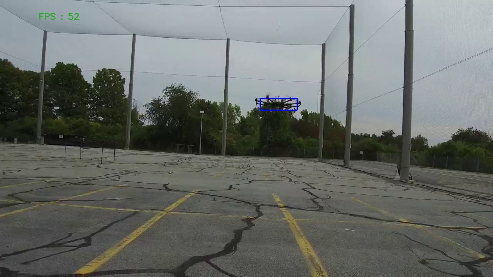

# Object Tracker for Drone Localization

This utility is a C++ code which can take a recorded video file of a Drone flying around in an outdoor environment, and return the same feed with a bounding box drawn around the drone showing at all times where it is in every frame.

# Legend

1. Original_uav: This directory contains the raw images from the video feed sampled at every 100 frames.
2. Tracked_uav: This directory contains the images from the video feed with the UAV tracked inside a bounding box.
3. Scripts: In this folder are a few python scripts that were used to perform similar tracking operations on the gazebo sensor data.

## How it works

There are two methods here which are designed to work hand in hand with each other.
The first one is to detect drones in a frame using Contour properties via thresholding and morphological operations which helps in localalizing the drone at the start of the video. The second one is the OpenCV object tracker utility which uses the CSRT Object Tracker inside OpenCV to continuously track the drone through every frame. Both the methods together make it very easy to perform Drone localization through every frame by error-correcting each other.

## Dependencies
1. C++11 capabilities

2. CMAKE: 2.8 (minimum)

3. This code uses the latest OpenCV version with one of the earliest updates: OpenCV 4.5.1
You will need that to read the video frames and run image processing operations on the frames to detect the drones.

## How to use

There is only one C++ file that is used to run the whole utility which is the <i>"main.cpp"</i> file.

You will need a video file that has a recording of a drone flying around in an outside environment.

1. Clone this repository into a local system.

2. Open the main.cpp file into your favorite editor and edit the location of the video file on line number 26:
    ```
    VideoCapture video("/home/$(user)/path/to/mp4");
    ```

3. Next, let's compile the C++ file.
    Make sure you have the opencv installation that can be detected automatically when you compile packages that use the opencv library. If that is not the case then you can manually add a line to detect the opencv package if you have installed it outside in another folder. 
    If you do not have the latest version of the OpenCV package then you can try using this package with another version of OpenCV and make the changes in the CMakeLists.txt file to update the version to look for. However not all features of the utlity might work with previous versions and you would have to make a few changes in the code that run similar functionality.

    To Compile the C++ package open up your favorite terminal application and run the following commands:
    ```
    cd ObjectTracker
    cmake --build cmake-build-debug --target CMakeFiles/ObjectTracker.dir/main.cpp.o -- -f cmake-build-debug/CMakeFiles/ObjectTracker.dir/build.make --always-make
    ```

4. Finally, we run the Object Tracker utility by entering the following command:
    ```
    ./cmake-build-debug/ObjectTracker
    ```

This should open up a windows with the label Tracking that will run the video file but this time with a bounding box around the drone for all frames.


